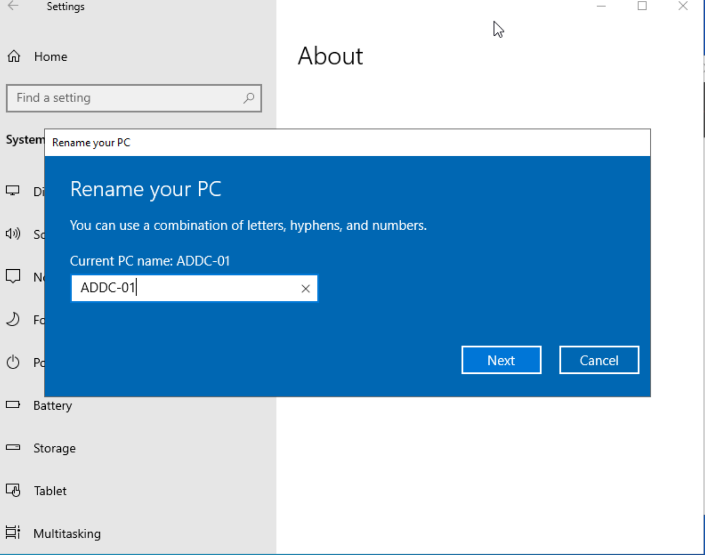
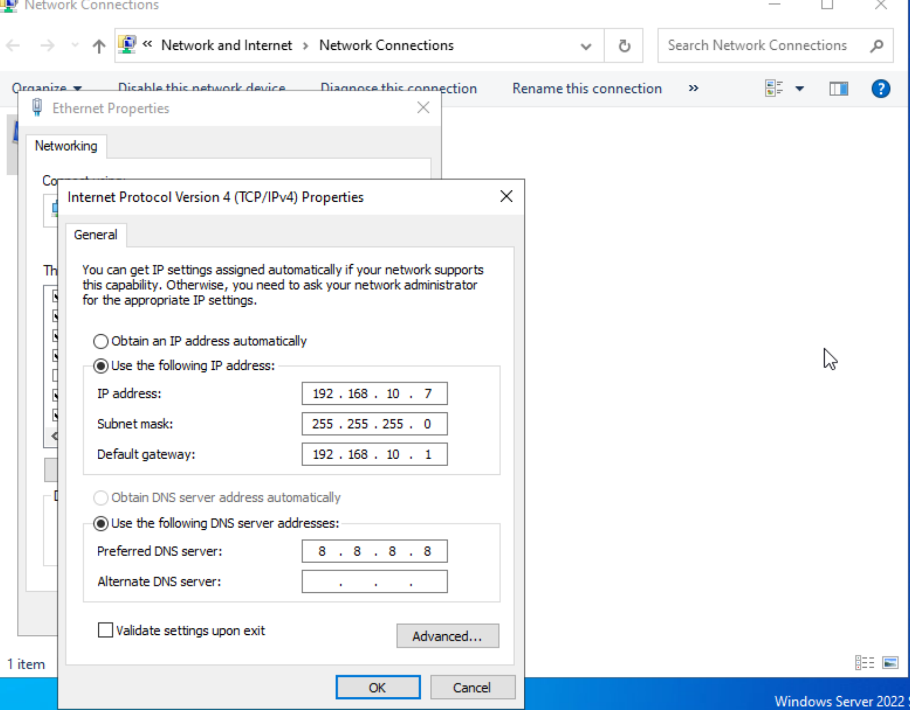
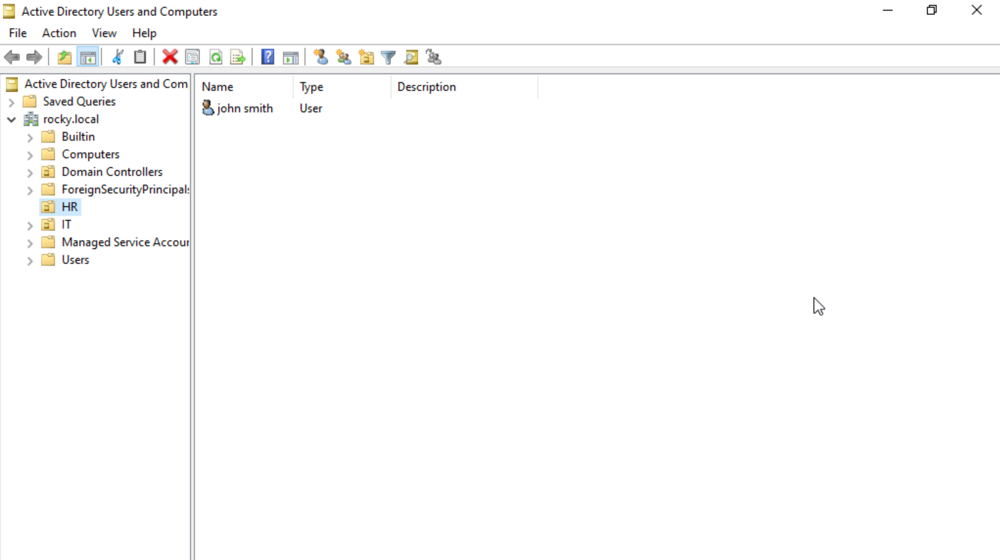
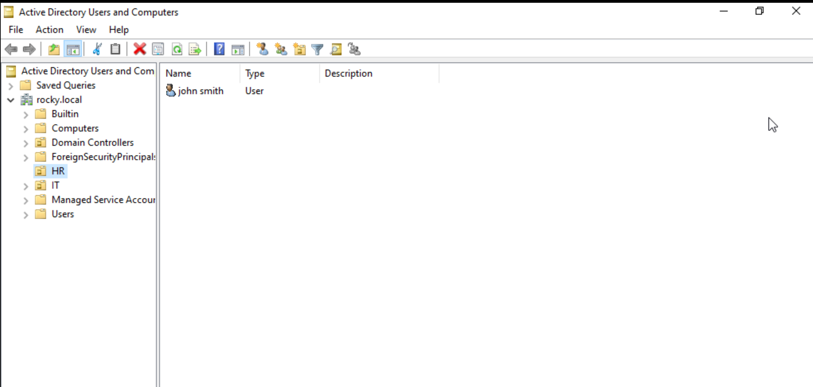
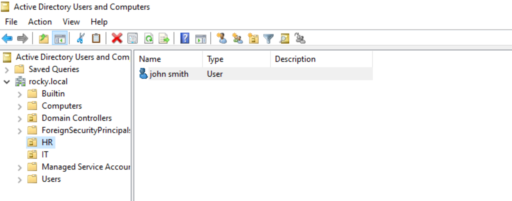
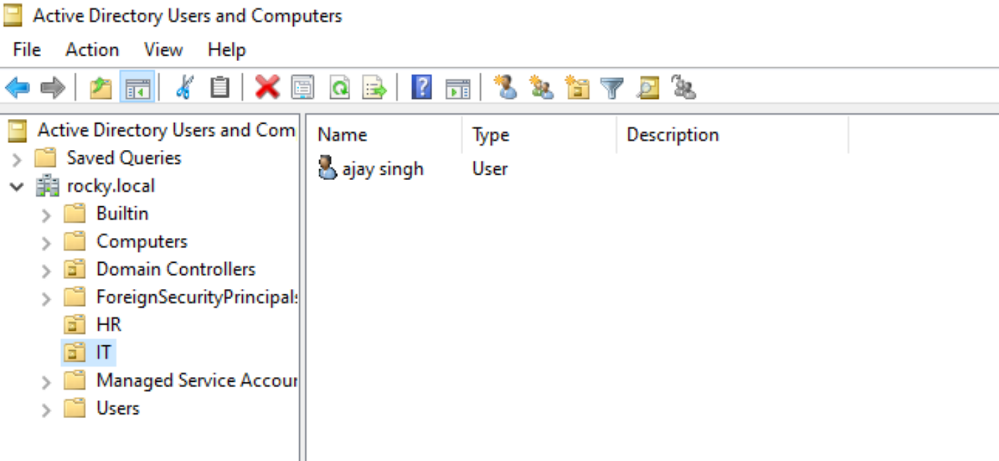
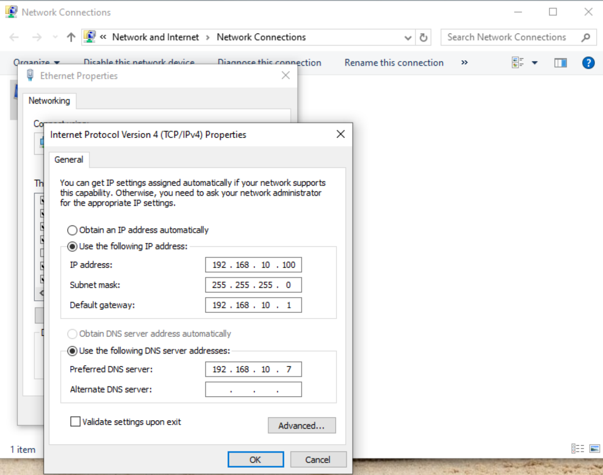
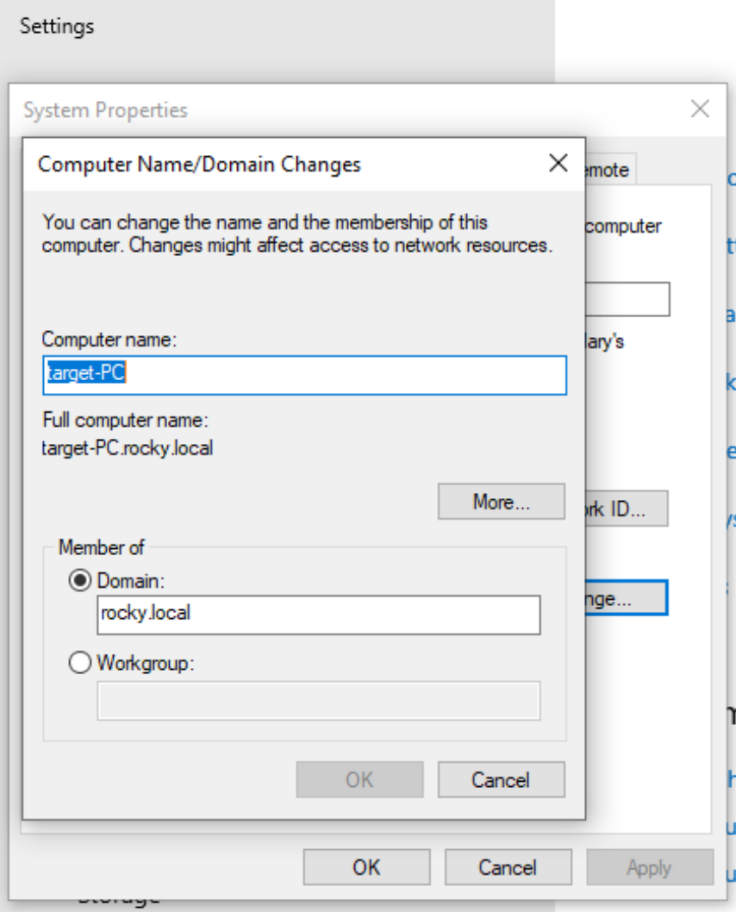
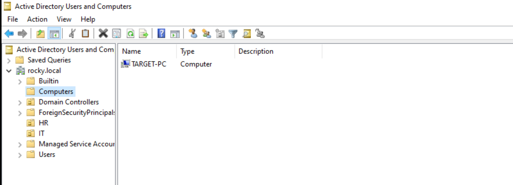

# 🏢 Lab Setup — Active Directory Domain Controller (ADDC-01)

## 📌 Overview
This section covers the complete setup of an Active Directory Domain Controller (AD) using Windows Server. This environment simulates a real-world enterprise network where centralized authentication, user management, and security logging are performed.

This setup is critical for SOC operations because it generates authentication logs (Event ID 4624, 4625), which are used to detect attacks such as brute force and unauthorized access.

---

## 🌐 Step 0 — Install Windows Server 2022
- Download Windows Server 2022 ISO  
- Create VM in VirtualBox  
- Install the operating system  

---

## 🖥️ Step 1 — Rename Machine
- Go to Server Manager → Local Server → Computer Name → Change  

Set:
```
ADDC-01
```

- Restart system  

📸 Figure 1 — Hostname (ADDC-01)  


---

## 🌐 Step 2 — Configure Static IP

Set:
```
IP Address: 192.168.10.10
Subnet Mask: 255.255.255.0
Gateway: 192.168.10.1
DNS: 8.8.8.8
```

👉 DNS must point to itself for Active Directory to function properly  

📸 Figure 2 — Static IP Configuration  


---

## ⚙️ Step 3 — Install Active Directory Domain Services (AD DS)
- Open Server Manager  
- Click **Add Roles and Features**  
- Select:

```
Active Directory Domain Services
```

📸 Figure 3 — AD DS Installation  


---

## 🚀 Step 4 — Promote to Domain Controller
- Click **Promote this server to a domain controller**  
- Select:

```
Add a new forest
```

- Set domain:
```
rocky.local
```

- Set DSRM password  

📸 Figure 4 — Domain Setup  


---

## 🏢 Step 5 — Create Organizational Units (OU)
- Open Active Directory Users and Computers  

Create:
```
HR
IT
```

📸 Figure 5 — OU Creation  


---

## 👤 Step 6 — Create Users

### HR Department
```
jsmith
```

📸 Figure 6 — HR User  


---

### IT Department
```
asingh
```

📸 Figure 7 — IT User  


---

## 🔗 Step 7 — Join Windows 10 to Domain

### ⚠️ Step 7.1 — Change DNS First (IMPORTANT)
On `target-PC`:

- Go to Network Settings → IPv4  
- Change DNS from:
```
8.8.8.8
```
To:
```
192.168.10.7
```

📸 Figure 9 — DNS Configuration  


---

### Step 7.2 — Domain Join Process

- Go to:
  - **This PC → Properties**
  - Click **Advanced system settings**
  - Go to **Computer Name tab**
  - Click **Change**

- Select:
```
Domain
```

- Enter:
```
rocky.local
```

- Enter credentials:
```
Administrator
```

- Restart system  

📸 Figure 8 — Domain Join  


---

## 🔍 Step 8 — Verify in Active Directory
- Open Active Directory Users and Computers  
- Check:
  - Computers → `target-PC` appears  

📸 Figure 10 — Verification  


---

## 🛡️ Step 10 — Install Splunk Forwarder & Sysmon on AD Server

To monitor Domain Controller activity, install:

- Splunk Universal Forwarder  
- Sysmon64  
- sysmonconfig.xml  
- inputs.conf  

👉 Refer:
[Click here for Windows 10 Setup Guide](../windows10_setup.md)
                                                                                                                                        
👉 This enables:
- Domain Controller log monitoring  
- Authentication tracking  
- SOC-level visibility
  
---

## ✅ Final Verification
- Domain Controller configured ✅  
- Users created (HR & IT) ✅  
- Windows joined to domain ✅  
- Logs visible in Splunk ✅  

---

## 🎯 Conclusion
The Active Directory Domain Controller (ADDC-01) is successfully configured with domain `rocky.local`. Organizational Units and users have been created, and the Windows 10 target machine has been joined to the domain.

Both endpoint and domain controller logs are forwarded to Splunk, enabling centralized monitoring and real-time threat detection in a SOC environment.

---
