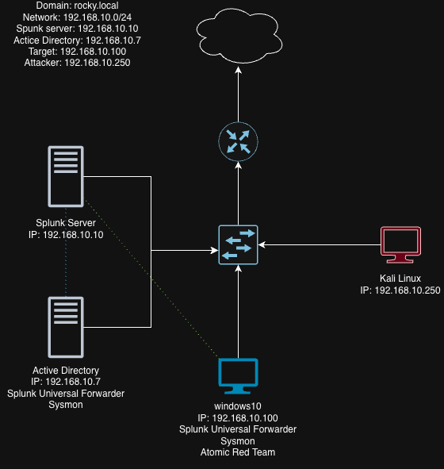

# 🛡️ Active Directory Threat Detection Lab — Splunk & MITRE ATT&CK

## 📌 Overview
This project demonstrates the design and implementation of a complete **Security Operations Center (SOC) Home Lab**. It simulates a real-world enterprise environment with centralized logging, endpoint monitoring, Active Directory, and attack detection using Splunk SIEM.

---

## 🧠 Project Objectives
- Build a real-world SOC environment  
- Collect and analyze logs using Splunk  
- Simulate attacks (Brute Force & MITRE ATT&CK)  
- Detect threats using SIEM queries  
- Understand enterprise security monitoring  

---

## 🏗️ Lab Architecture

### 💻 Components:
- **Splunk Server (Ubuntu)** → SIEM & Log Analysis  
- **Windows Server (ADDC-01)** → Domain Controller  
- **Windows 10 (target-PC)** → Endpoint Machine  
- **Kali Linux (192.168.10.100)** → Attacker Machine  

---

## 🌐 Network Architecture

📸 Network Diagram  


---

## 🌐 Network Configuration

| System | IP Address | Role |
|-------|-----------|------|
| Splunk Server | 192.168.10.10 | SIEM |
| AD Server (ADDC-01) | 192.168.10.7 | Domain Controller |
| Windows 10 | 192.168.10.100 | Target Machine |
| Kali Linux | 192.168.10.250 | Attacker |

---

## ⚙️ Lab Setup Steps

### 1️⃣ Splunk Server Setup
👉 [Click here for Splunk Setup](splunk_server_setup.md)

- Installed Splunk Enterprise on Ubuntu  
- Configured receiving port (9997)  
- Created index (`endpoint`)  

---

### 2️⃣ Windows 10 Target Setup
👉 [Click here for Windows 10 Setup](windows10_installation.md)

- Installed Windows 10  
- Installed Splunk Universal Forwarder  
- Installed Sysmon + configuration  
- Configured `inputs.conf`  

---

### 3️⃣ Active Directory Setup
👉 [Click here for AD Setup](ad_server_setup.md)

- Installed AD DS  
- Created domain: `rocky.local`  
- Created OUs: HR, IT  
- Created users:
  - `jsmith` (HR)  
  - `asingh` (IT)  
- Joined Windows 10 to domain  

---

### 4️⃣ Attack Simulation — Brute Force (Hydra)
👉 [Click here for Attack Detection](attack_detect_logs.md)

- Performed brute force using Hydra  
- Generated:
  - Event ID 4625 (failed login)  
  - Event ID 4624 (successful login)  
- Detected attack using Splunk  

---

### 5️⃣ Atomic Red Team Simulation
👉 [Click here for Atomic Red Team](atomic_red_team_simulation.md)

- Simulated MITRE ATT&CK techniques:
  - T1059 (PowerShell Execution)  
  - T1003 (Credential Dumping)  
- Detected logs in Splunk  

---

## 📊 Detection & Monitoring

### 🔎 Splunk Queries

#### Failed Logins
```spl
index=endpoint EventCode=4625
```

#### Successful Logins
```spl
index=endpoint EventCode=4624
```

#### Brute Force Detection
```spl
index=endpoint EventCode=4625
| stats count by src_ip, user
| where count > 5
```

#### PowerShell Activity
```spl
index=endpoint "powershell"
```

---

## 🚨 Key Security Events

| Event ID | Description |
|---------|------------|
| 4624 | Successful Login |
| 4625 | Failed Login |
| 1 (Sysmon) | Process Creation |

---

## 🔥 Key Features
- Real-world SOC simulation  
- Centralized logging (Splunk SIEM)  
- Endpoint monitoring (Sysmon)  
- Active Directory integration  
- Attack simulation (Hydra & Atomic Red Team)  
- Detection queries (SOC level)  

---

## 📸 Project Highlights
- Brute force attack detection  
- MITRE ATT&CK simulation  
- Domain-based authentication logs  
- Real-time log monitoring  

---

## 🔥 Skills Gained
- SIEM (Splunk)  
- Log Analysis  
- Threat Detection  
- Active Directory Administration  
- Incident Investigation  
- MITRE ATT&CK Framework  

---

## 🎯 Conclusion
This project demonstrates the implementation of a complete SOC lab with attack simulation and detection capabilities. It provides hands-on experience with SIEM tools, Active Directory, and threat detection techniques used in real-world cybersecurity environments.

---

## 👨‍💻 Author
Rakesh A R  
Aspiring Cybersecurity Analyst 
https://www.linkedin.com/in/rakesh-a-r-595517288

---
