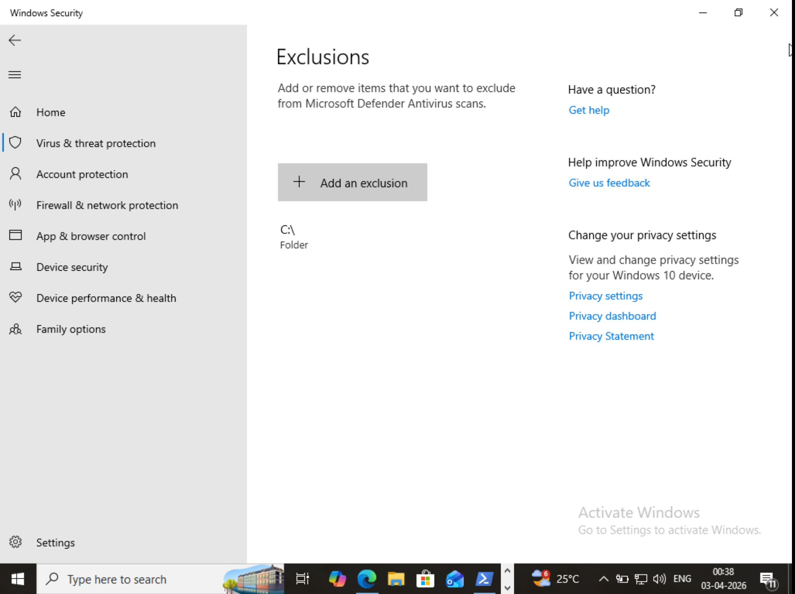
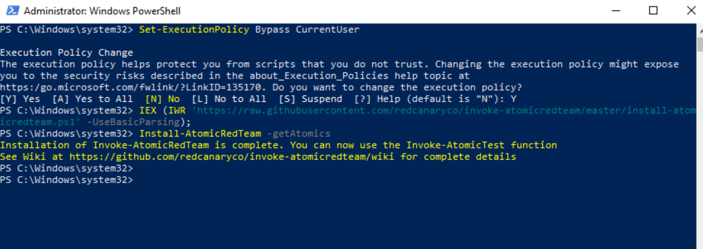
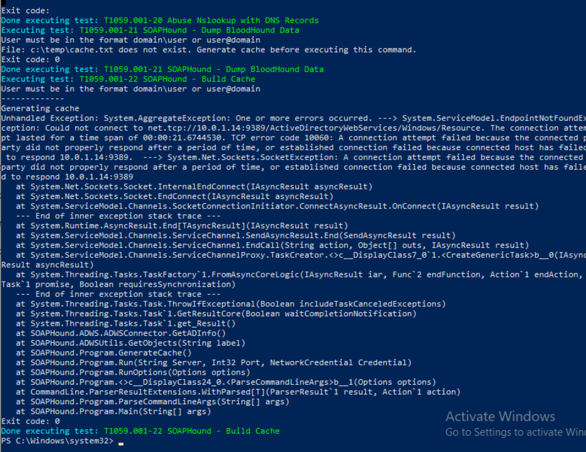
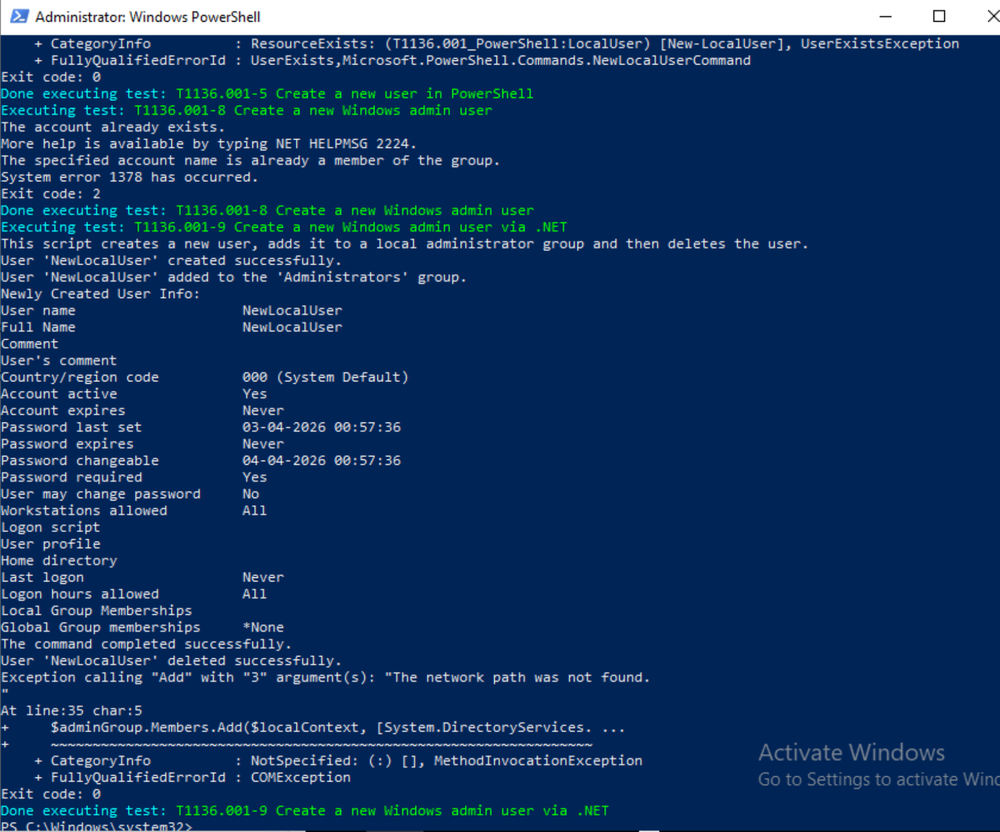
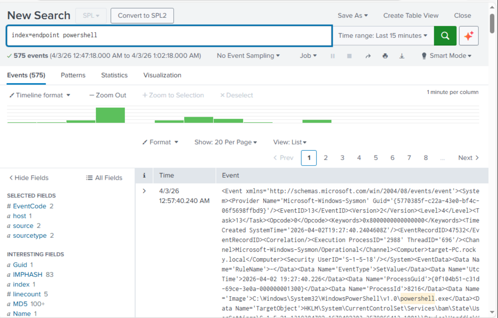
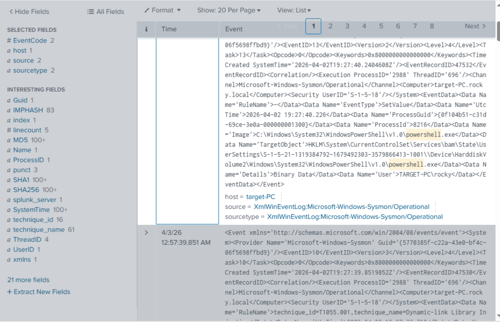

# ☢️ Lab — Atomic Red Team Simulation & Detection (MITRE ATT&CK)

## 📌 Overview
This section demonstrates attack simulation using Atomic Red Team to emulate real-world adversary techniques based on the MITRE ATT&CK framework.

The goal is to:
- Simulate attack techniques on the Windows 10 target machine  
- Generate logs using Sysmon and Windows Event Logs  
- Detect and analyze these activities in Splunk  

---

## 🧠 What is Atomic Red Team?
Atomic Red Team is an open-source project used to simulate real-world attack techniques mapped to the MITRE ATT&CK framework for testing detection capabilities.

---

## ⚠️ Step 1 — Configure Windows Security (IMPORTANT 🔥)

Before installing Atomic Red Team:

- Open **Windows Security**  
- Go to **Virus & Threat Protection**  
- Click **Manage Settings**  
- Scroll to **Exclusions**  
- Click **Add or Remove Exclusions**  
- Click **Add Exclusion → Folder**  
- Add:

```
C:\
```

👉 This prevents Windows Defender from blocking Atomic scripts.

📸 Figure 1 — Windows Defender Exclusion  


---

## ⚙️ Step 2 — Install Atomic Red Team

### Open PowerShell as Administrator

### Set Execution Policy
```powershell
Set-ExecutionPolicy Bypass CurrentUser
```

### Install Framework
```powershell
IEX (IWR 'https://raw.githubusercontent.com/redcanaryco/invoke-atomicredteam/master/install-atomicredteam.ps1' -UseBasicParsing)
```

### Download Atomic Tests
```powershell
Install-AtomicRedTeam -getAtomics
```

👉 This installs Atomic Red Team and all MITRE test cases.

📸 Figure 2 — Atomic Installation  


---

## 📂 Step 3 — Navigate to Atomic Directory

```powershell
cd C:\AtomicRedTeam\invoke-atomicredteam
```

---

## ⚔️ Step 4 — Execute Attack Techniques

### 🔹 PowerShell Execution (T1059.001)
```powershell
Invoke-AtomicTest T1059.001 -TestNumbers 1
```

👉 Simulates malicious PowerShell activity.

📸 Figure 3 — PowerShell Attack (T1059.001)  


---

### 🔹 Credential Dumping (T1136.001)
```powershell
Invoke-AtomicTest T1136.001 -TestNumbers 1
```

👉 Simulates credential dumping behavior.

📸 Figure 4 — Credential Dumping (T1136.001)  


---

## 🔍 Step 5 — Detect Logs in Splunk

### PowerShell Activity
```spl
index=endpoint "powershell"
```

---

### Process Execution (Sysmon)
```spl
index=endpoint EventCode=1
```

---

### Credential Dumping Indicators
```spl
index=endpoint "lsass"
```

📸 Figure 5 — Splunk Logs  


---

## 🚨 Step 6 — Detection Logic (SOC Use Case)

### Detect PowerShell Abuse
```spl
index=endpoint "powershell.exe"
| stats count by host, user
```

---

### Detect LSASS Access
```spl
index=endpoint "lsass.exe"
```

---

### Detect Suspicious Process Execution
```spl
index=endpoint EventCode=1
| search cmd.exe OR powershell.exe
```

📸 Figure 6 — Detection Queries  


---

## ✅ Final Verification
- Defender exclusion configured ✅  
- Atomic Red Team installed ✅  
- Attack techniques executed (T1059, T1003) ✅  
- Logs generated and visible in Splunk ✅  
- Detection queries working ✅  

---

## 🎯 Conclusion
Atomic Red Team simulation successfully emulated real-world MITRE ATT&CK techniques such as PowerShell execution and credential dumping. These activities were logged and detected in Splunk, demonstrating advanced SOC detection capabilities.

---
