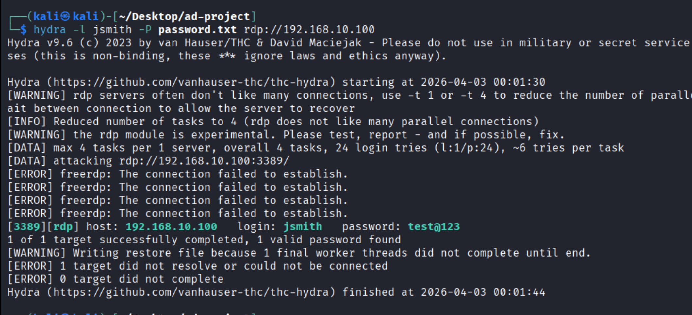
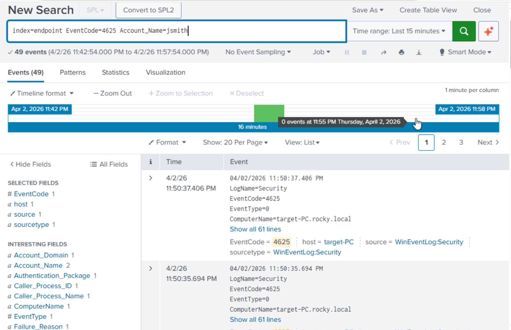
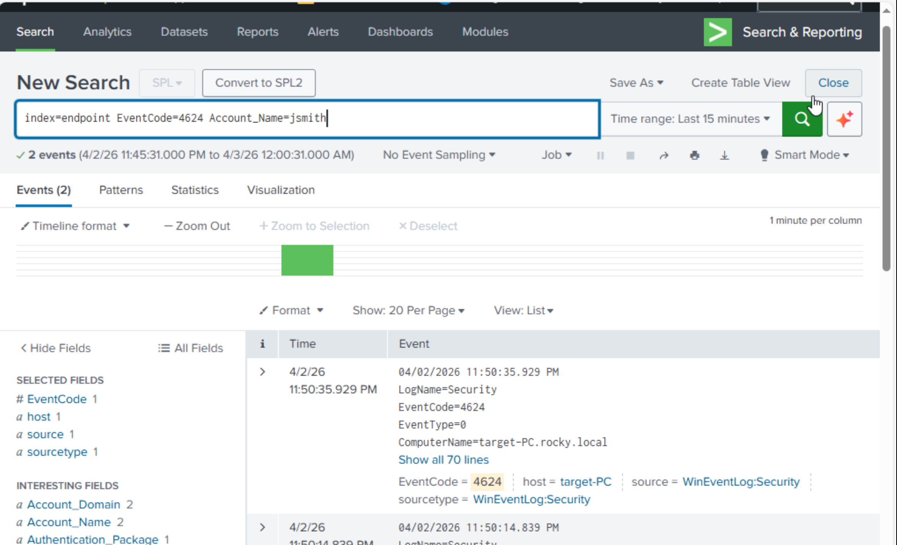
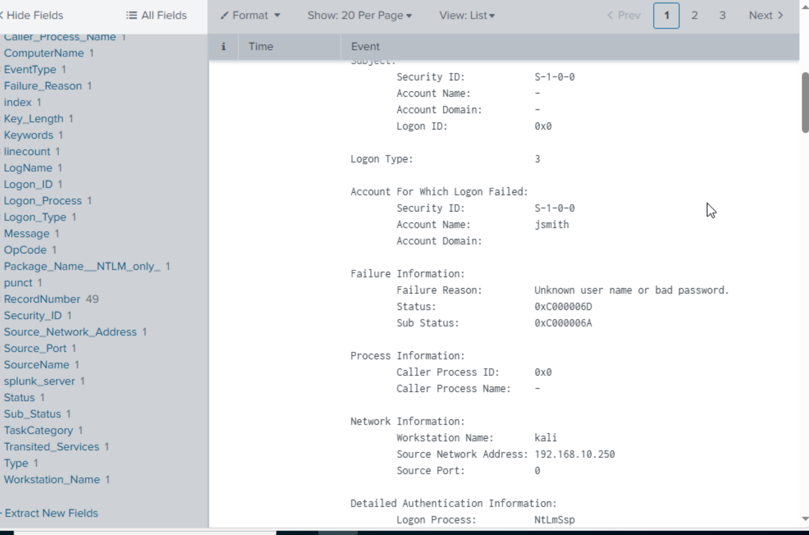
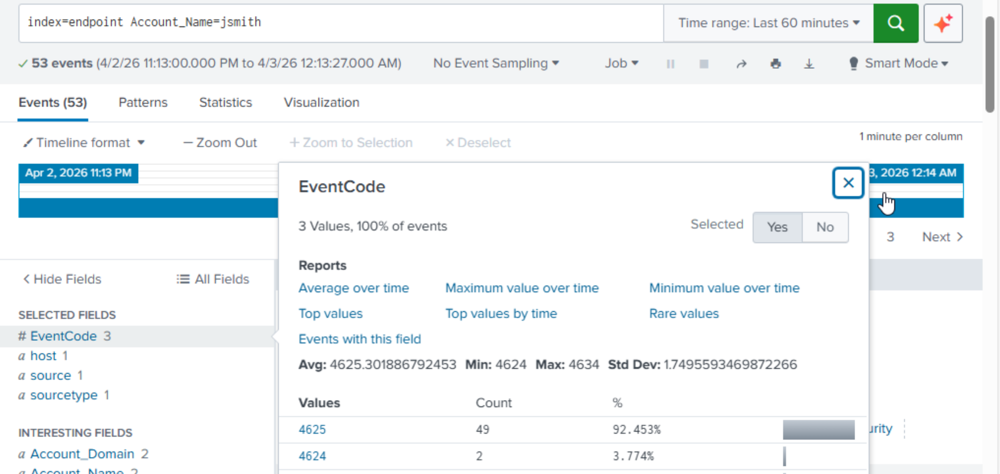

# ⚔️ Lab — Attack Simulation & Log Detection (Brute Force using Hydra)

## 📌 Overview
This section demonstrates a brute force attack simulation using Hydra from an attacker machine to the Windows 10 target machine (`target-PC`) and analyzes the generated logs in Splunk.

The goal is to generate and detect:
- Failed login attempts (Event ID 4625)
- Successful login (Event ID 4624)

This validates SOC monitoring and detection capabilities in a real-world scenario.

---

## 🧠 Attack Scenario
- Attacker Machine → Kali Linux  
- Attacker IP → `192.168.10.250`  
- Target Machine → Windows 10 (`target-PC`)  
- Target IP → `192.168.10.100`  
- Domain → `rocky.local`  
- Target User → `jsmith`  

👉 The attacker performs a brute force attack to guess the user password.

---

## ⚙️ Step 1 — Prepare Environment
Ensure:
- Target machine is domain joined (`rocky.local`)  
- User `jsmith` exists in AD  
- Splunk Forwarder is running  
- Sysmon is active  
- Logs are being forwarded to Splunk  

---

## ⚔️ Step 2 — Perform Brute Force Attack using Hydra

### 🔹 Hydra Command
```bash
hydra -l jsmith -P passwords.txt smb://192.168.10.100
```

### 🔍 Explanation
- `-l jsmith` → target username  
- `-P passwords.txt` → password list  
- `smb://192.168.10.100` → target system  

👉 This generates:
- Multiple failed login attempts → **Event ID 4625**  
- One successful login → **Event ID 4624** (if password is correct)

📸 Figure 1 — Hydra Brute Force Attack  


---

## 🔍 Step 3 — Detect Failed Login Attempts (4625)

```spl
index=endpoint EventCode=4625 user=jsmith
```

👉 This shows multiple failed login attempts from attacker machine.

📸 Figure 2 — Failed Logins (4625)  


---

## 🔍 Step 4 — Detect Successful Login (4624)

```spl
index=endpoint EventCode=4624 user=jsmith
```

👉 This shows successful login after brute force.

📸 Figure 3 — Successful Login (4624)  


---

## 📊 Step 5 — Analyze Attack Pattern

👉 Indicators of brute force:
- Multiple failed login events (4625)  
- Same username → `jsmith`  
- Same source IP → `192.168.10.100`  

👉 Followed by:
- Successful login event (4624)

📸 Figure 4 — Attack Pattern  


---

## 🚨 Step 6 — Detection Logic (SOC Use Case)

### 🔎 Brute Force Detection Query
```spl
index=endpoint EventCode=4625 user=jsmith
| stats count by src_ip, user
| where count > 5
```

👉 Detects multiple failed login attempts from same IP.

---

### 🔎 Combined Detection (4624 + 4625)
```spl
index=endpoint (EventCode=4624 OR EventCode=4625) user=jsmith
| stats count by EventCode, src_ip
```

📸 Figure 5 — Detection Query Output  


---

## ✅ Final Verification
- Hydra brute force attack executed ✅  
- Failed login events (4625) generated ✅  
- Successful login event (4624) detected ✅  
- Logs visible in Splunk ✅  
- Attack pattern successfully identified ✅  

---

## 🎯 Conclusion
The brute force attack using Hydra successfully generated multiple failed login attempts followed by a successful login. These events were captured and analyzed in Splunk.

This demonstrates real-world attack detection capability using SIEM and validates SOC monitoring effectiveness.

---
